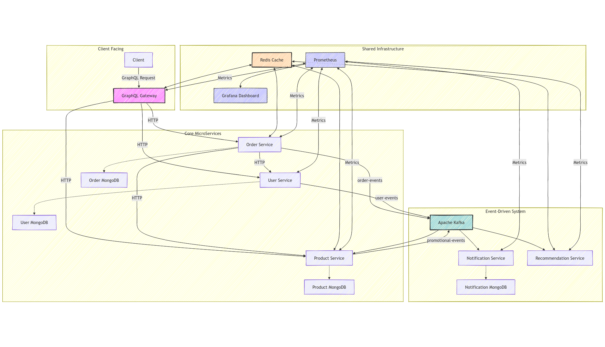

# 🚀 E-Commerce Microservices Backend: Scalable, Event-Driven Architecture

#### This project implements a backend system for an e-commerce platform utilizing a microservices architecture with graphql-gateway being single point of entry. While developing this project i focused on building a scalable, event-driven architecture that can handle high traffic and provide real-time updates. The system is designed to be modular, allowing for easy addition of new features and services.

---

## ✨ Why This Architecture Stands Out

### 🧩 Independent & Scalable Services

Each core domain (Users, Products, Orders) operates as a standalone service with dedicated databases. Scale individual components independently to meet demand spikes without over-provisioning resources.

### ⚡ Real-Time Event-Driven Communication

Services communicate asynchronously via **Apache Kafka**, ensuring loose coupling and fault tolerance. Key events (new orders, inventory updates) trigger real-time reactions across the system while **Dead Letter Queues** handle failures gracefully.

### 🔍 Unified Data Access with GraphQL

Clients interact through a single **GraphQL Gateway** that aggregates data from multiple services, reducing roundtrips and enabling tailored responses. Redis caching slashes response times for frequent queries.

### 🔒 Zero-Trust Security Model

JWT-based authentication secures every API call. Tokens issued by the User Service are validated at the gateway, ensuring only authorized requests reach downstream services.

### 📊 Observability First

Monitor every heartbeat of the system with **Prometheus metrics** and **Grafana dashboards**. Track API latency, Kafka consumer lag, cache hit ratios, and more in real time.

---

## 🏗️ Architecture Overview



### Core Components Flow

1. **Client Requests** hit the GraphQL Gateway (4000) for unified access.
2. **Synchronous Calls**: Gateway uses Axios to fetch user/product/order data directly.
3. **Asynchronous Events**: Services emit Kafka events for cross-domain actions:
   - Order Service → `order-events` → Inventory updates & recommendations.
   - Product Service → `promotional-events` → Targeted email campaigns.
4. **Redis Cache**: Strategically placed in Gateway, Product, and Recommendation services for instant data access.
5. **Monitoring**: All services expose Prometheus metrics, visualized in Grafana.

---

## 🛠️ Tech Stack Deep Dive

| Category            | Technologies                                                                        |
| ------------------- | ----------------------------------------------------------------------------------- |
| **Core Framework**  | Node.js, Express.js, TypeScript                                                     |
| **API Gateway**     | GraphQL                                                                             |
| **Event Streaming** | Apache Kafka, KafkaJS                                                               |
| **Databases**       | MongoDB (1 per service)                                                             |
| **Caching**         | Redis (Response, Product, Order, Recommendation caching)                            |
| **Auth**            | JWT, Bcrypt, Gateway-level validation                                               |
| **Notifications**   | Nodemailer, Priority Queues (Critical/Standard), Dead-Letter-Queue, Cron Scheduling |
| **Monitoring**      | Prometheus, Grafana, Custom Metrics Endpoints                                       |
| **DevOps**          | Docker, Docker Compose, ESLint, Prettier, Husky                                     |

---

## 🚦 Running Locally in 5 minutes

### Prerequisites

- Docker & Docker Compose
- Node.js v18+

### Launch using Docker Compose

```bash
git clone https://github.com/ayushjrathod/pratilipi-backend-assignment.git
cd pratilipi-backend-assignment

# Spin up all services with metrics & monitoring
docker-compose up --build
```

**Access Endpoints:**

- **GraphQL**: `http://localhost:4000/graphql`
- **Grafana Dashboard**: `http://localhost:3000/dashboard` (admin/admin)

---

## 🌟 Key Features Breakdown

### 1. Intelligent Product Recommendations

- **Rule Engine**: Analyzes purchase history (stored in Redis) to suggest complementary products.
- **Event-Driven Updates**: New orders trigger real-time recommendation recalculations.
- **Cached Results**: Users get instant suggestions from Redis, reducing load on the Recommendation Service.

### 2. Priority Notification System

- **Critical Alerts**: Order confirmations, password resets (High Priority Queue).
- **Promotional Emails**: Newsletters, sales (Standard Queue with rate limiting).
- **Automatic Retries**: Failed emails land in Kafka DLQ for later processing.

## Postman Collection

- This collection is a workflow which will populate the database with mock data and the functionality of the application can be tested.
  - [Postman Collection](https://pratilipi-ayush-submission.postman.co/workspace/pratilipi-ayush-submission~2348e80a-9c52-4e30-86b1-c6f835587152/collection/30091103-a715c57f-468b-413a-9371-246ff2c0407a?action=share&creator=30091103)
- Using this collection, individual services can be tested as well. There are also example requests and responses stored for each service.
  - [Postman Collection](https://pratilipi-ayush-submission.postman.co/workspace/pratilipi-ayush-submission~2348e80a-9c52-4e30-86b1-c6f835587152/collection/30091103-c2321ae5-cb54-4d0d-a72f-7efdddfbb0bf?action=share&creator=30091103)

---

**Crafted with scalability in mind.**

- Feel free to reach out for any queries.
  - [LinkedIn](https://www.linkedin.com/in/ayushjrathod/)
  - [Email](mailto:ayushjrathod7@gmail.com)

---
